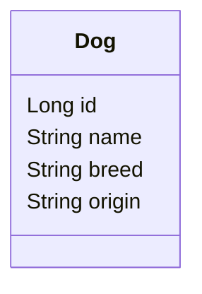

### Java Springboot - Build A Simple GraphQL Endpoint
It returns a list of dogs from an embedded H2 in memory database. It uses [Spring Initializer](https://start.spring.io/) to bootstrap the project with following dependencies:
1. `spring-boot-starter-web` - This starter pack is used for web application development and automatically adds libraries like Spring MVC, REST, Tomcat, and Jackson. 
2. `com.h2database` - This starter pack is used for the H2 in-memory database. 
3. `spring-boot-starter-data-jpa` - This starter pack includes JDBC, Hibernate, Transactions API, JPA, and Aspects.
4. `graphql-spring-boot-starter` - GraphQL Spring Boot Framework
5. `graphql-java-tools` - Tools to help map a GraphQL schema to existing Java objects
6. `graphiql-spring-boot-starter` - GraphQL Spring Boot Framework

### Database Entity



### GraphQL Queries & Mutation

**URL**:  http://localhost:8080/graphiql

**Schema**

```gql
type Dog {
    id: ID!
    name: String!
    breed: String!
    origin: String!
}

type Query {
    findAllDogs: [Dog]!
    findDogById(id:ID!): Dog!
}

type Mutation {
    deleteDogBreed(breed: String!) : Boolean
    updateDogName(newName: String!, id:ID!) : Dog!
}
```


